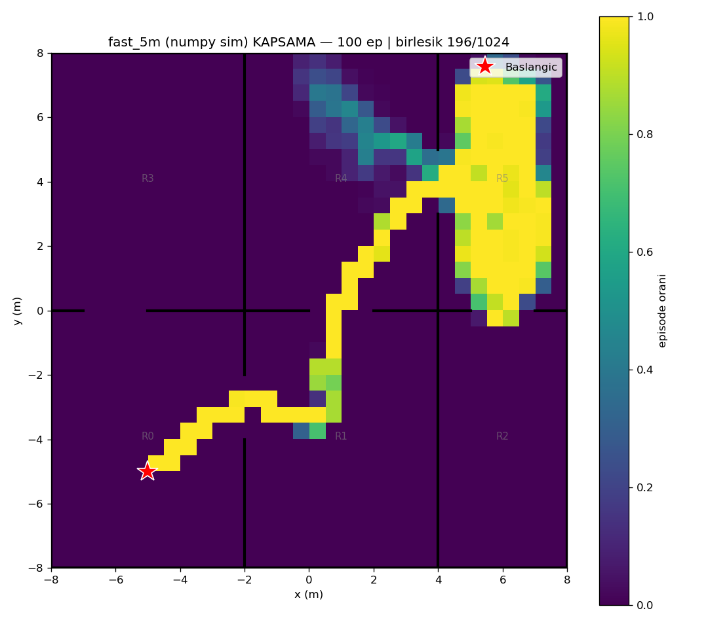
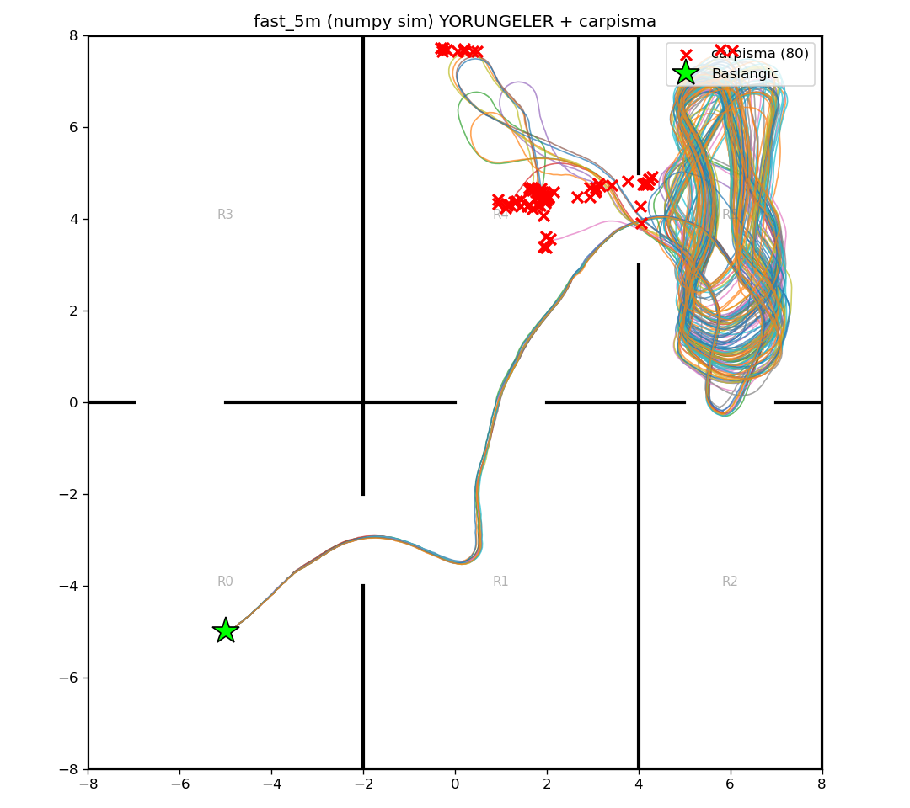

# fast_5m (numpy/Gymnasium sim) — 100 episode

Model: `fast_drone_final.zip` | deterministic | hareketli engeller aktif | ~100x hizli sim

| Metrik | Deger |
|---|---|
| Return | 114.9 ± 24.2 (min 68, max 158) |
| Voxel / 1024 | 132.4 ± 9.0 (min 109, max 151) |
| Oda / 6 | 5.0 ± 0.0 (min 5, max 5) |
| Episode / 2500 | 1872.1 ± 556.5 (min 626, max 2500) |
| Carpisma orani | 80% (80/100) |
| Birlesik kapsama | 196/1024 (19%) |

