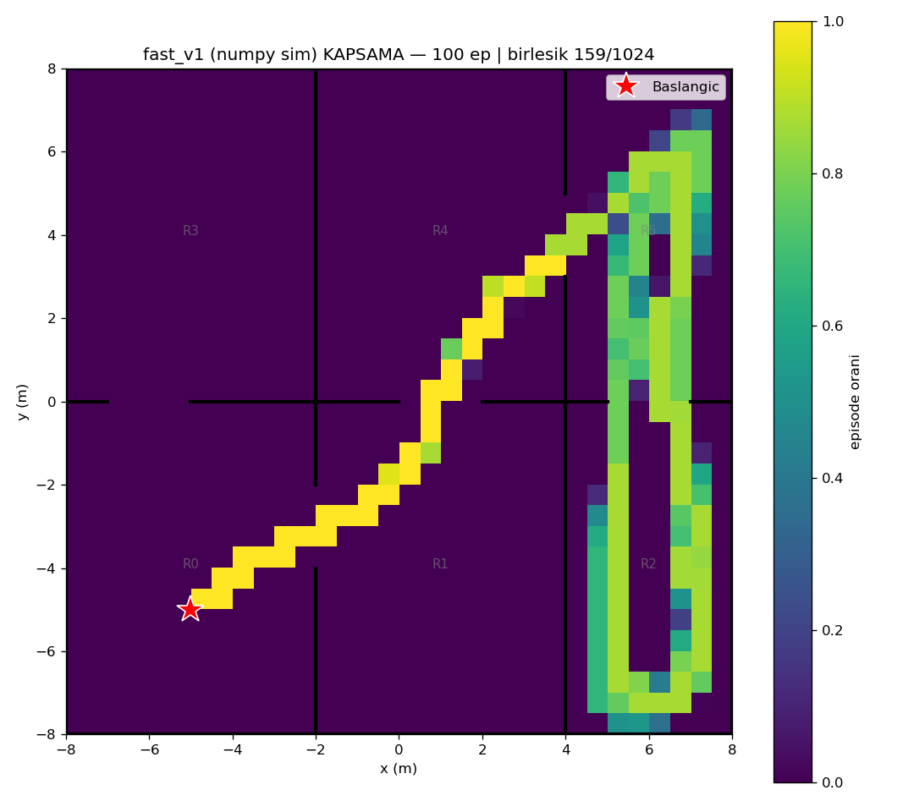
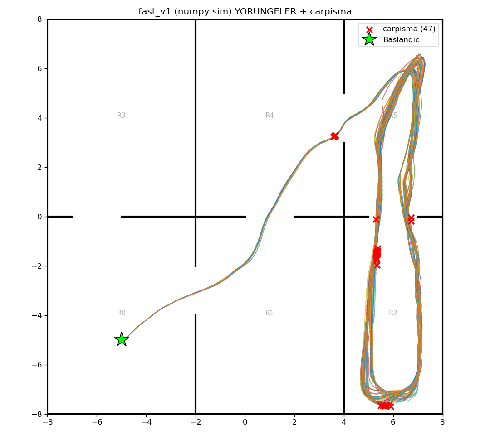

# fast_v1 (numpy/Gymnasium sim) — 100 episode

Model: `fast_drone_final.zip` | deterministic | hareketli engeller aktif | ~100x hizli sim

| Metrik | Deger |
|---|---|
| Return | 39.3 ± 40.6 (min -9, max 116) |
| Voxel / 1024 | 120.3 ± 37.6 (min 32, max 149) |
| Oda / 6 | 4.7 ± 0.7 (min 3, max 5) |
| Episode / 2500 | 1700.9 ± 967.5 (min 138, max 2500) |
| Carpisma orani | 47% (47/100) |
| Birlesik kapsama | 159/1024 (16%) |

