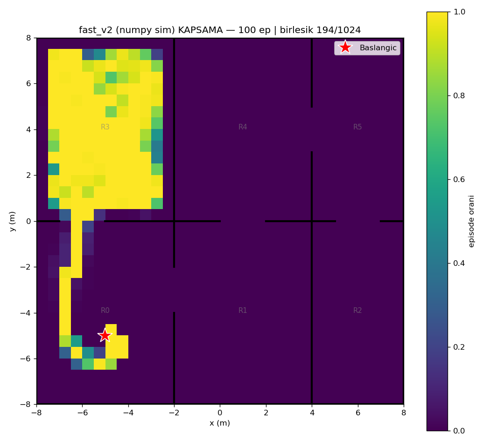
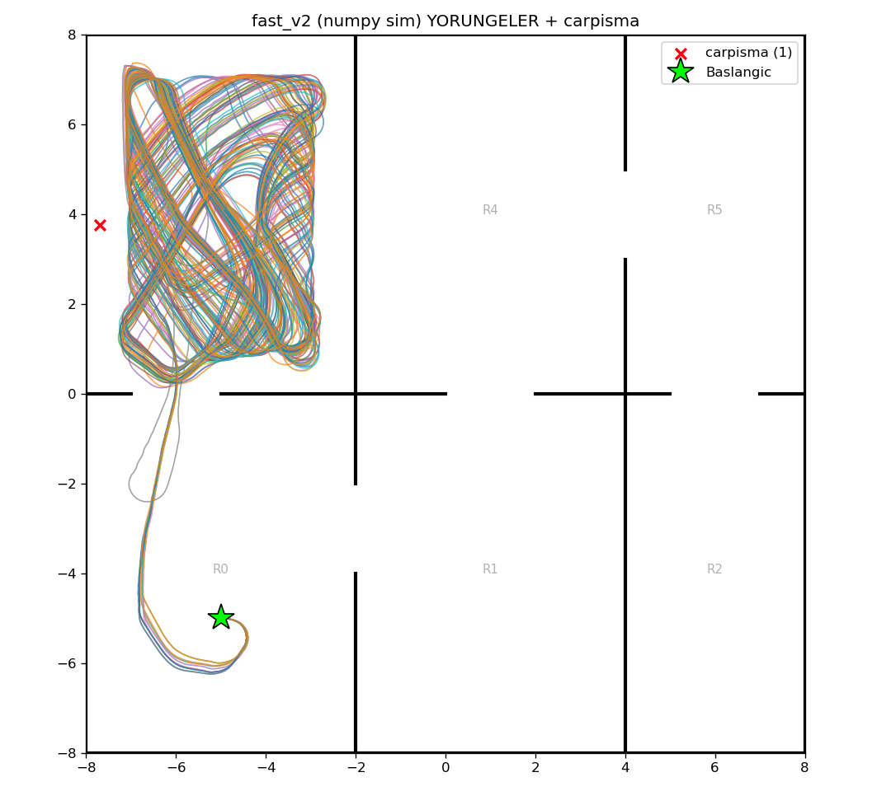

# fast_v2 (numpy/Gymnasium sim) — 100 episode

Model: `fast_drone_final.zip` | deterministic | hareketli engeller aktif | ~100x hizli sim

| Metrik | Deger |
|---|---|
| Return | 106.3 ± 9.8 (min 82, max 126) |
| Voxel / 1024 | 157.1 ± 4.3 (min 148, max 170) |
| Oda / 6 | 2.0 ± 0.0 (min 2, max 2) |
| Episode / 2500 | 2498.6 ± 14.2 (min 2357, max 2500) |
| Carpisma orani | 1% (1/100) |
| Birlesik kapsama | 194/1024 (19%) |

