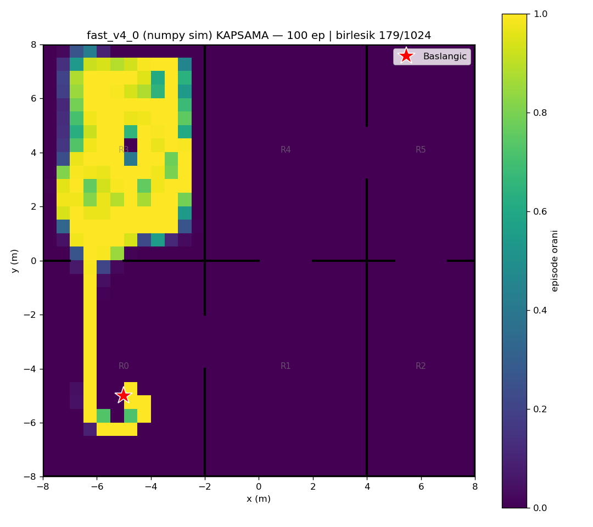
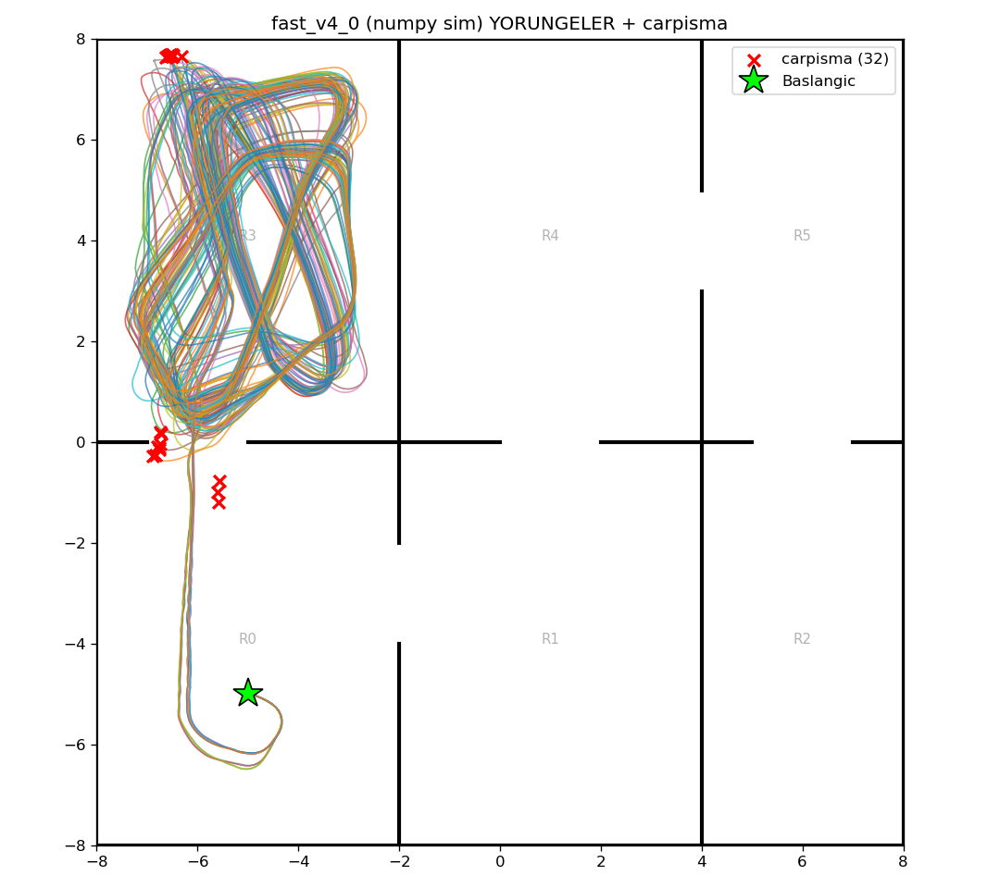

# fast_v4_0 (numpy/Gymnasium sim) — 100 episode

Model: `fast_drone_final.zip` | deterministic | hareketli engeller aktif | ~100x hizli sim

| Metrik | Deger |
|---|---|
| Return | 101.7 ± 9.4 (min 77, max 121) |
| Voxel / 1024 | 142.4 ± 5.8 (min 124, max 151) |
| Oda / 6 | 2.0 ± 0.0 (min 2, max 2) |
| Episode / 2500 | 2356.8 ± 278.9 (min 1282, max 2500) |
| Carpisma orani | 32% (32/100) |
| Birlesik kapsama | 179/1024 (17%) |

