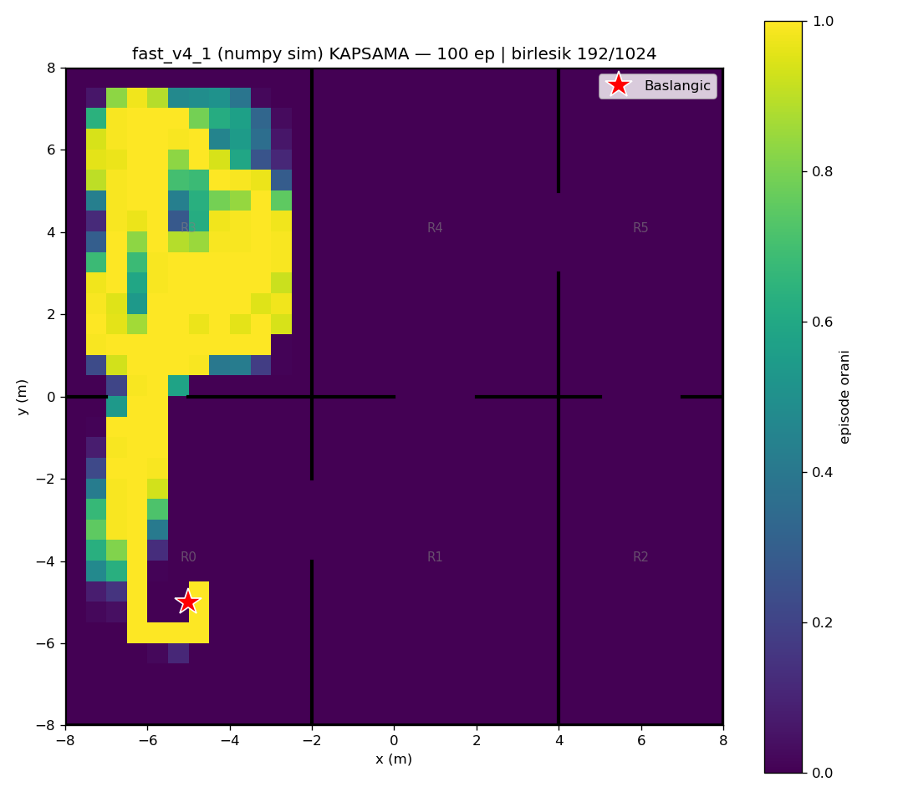
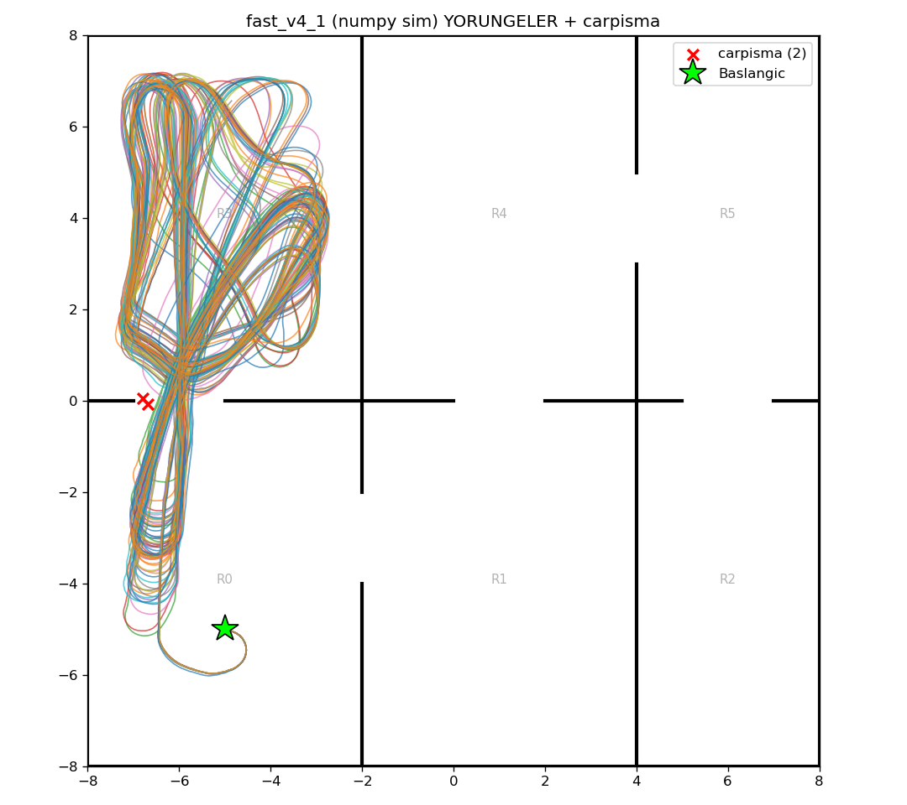

# fast_v4_1 (numpy/Gymnasium sim) — 100 episode

Model: `fast_drone_final.zip` | deterministic | hareketli engeller aktif | ~100x hizli sim

| Metrik | Deger |
|---|---|
| Return | 117.6 ± 12.1 (min 85, max 138) |
| Voxel / 1024 | 150.4 ± 7.5 (min 102, max 164) |
| Oda / 6 | 2.0 ± 0.0 (min 2, max 2) |
| Episode / 2500 | 2480.2 ± 192.2 (min 568, max 2500) |
| Carpisma orani | 2% (2/100) |
| Birlesik kapsama | 192/1024 (19%) |

