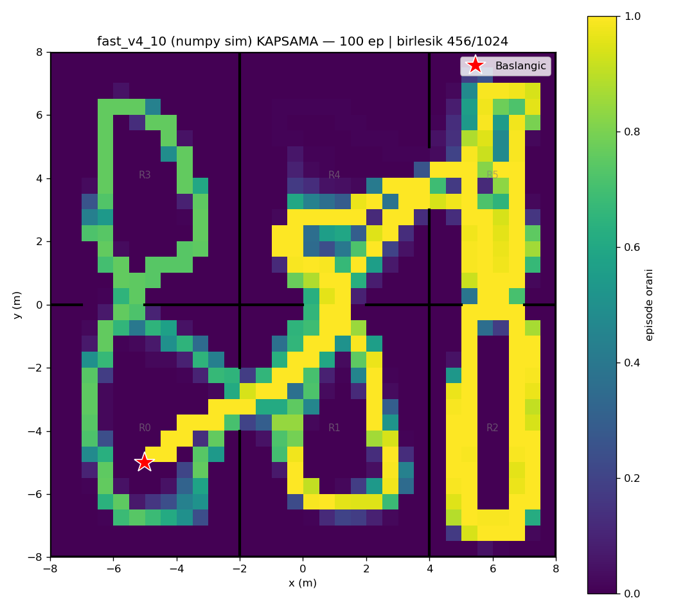
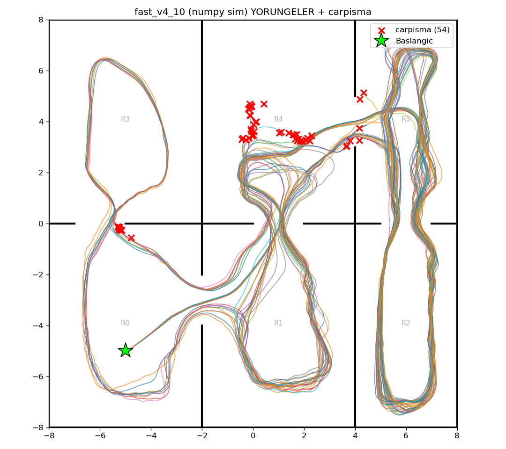

# fast_v4_10 (numpy/Gymnasium sim) — 100 episode

Model: `fast_drone_final.zip` | deterministic | hareketli engeller aktif | ~100x hizli sim

| Metrik | Deger |
|---|---|
| Return | 234.8 ± 42.7 (min 119, max 288) |
| Voxel / 1024 | 281.1 ± 33.2 (min 203, max 328) |
| Oda / 6 | 5.8 ± 0.4 (min 5, max 6) |
| Episode / 2500 | 2377.7 ± 216.0 (min 1468, max 2500) |
| Carpisma orani | 54% (54/100) |
| Birlesik kapsama | 456/1024 (45%) |

