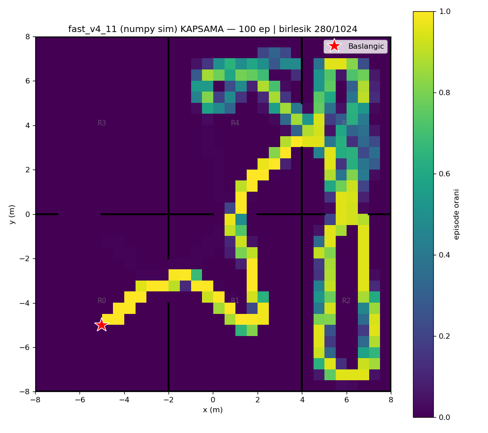
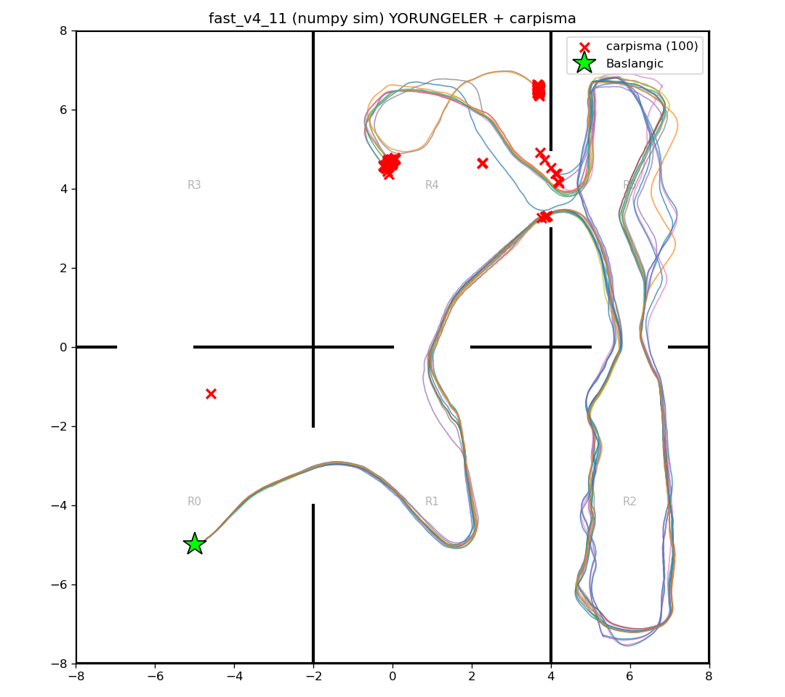

# fast_v4_11 (numpy/Gymnasium sim) — 100 episode

Model: `fast_drone_final.zip` | deterministic | hareketli engeller aktif | ~100x hizli sim

| Metrik | Deger |
|---|---|
| Return | 154.8 ± 23.7 (min 56, max 185) |
| Voxel / 1024 | 147.4 ± 25.3 (min 47, max 197) |
| Oda / 6 | 4.9 ± 0.4 (min 3, max 5) |
| Episode / 2500 | 730.1 ± 197.6 (min 201, max 1438) |
| Carpisma orani | 100% (100/100) |
| Birlesik kapsama | 280/1024 (27%) |

