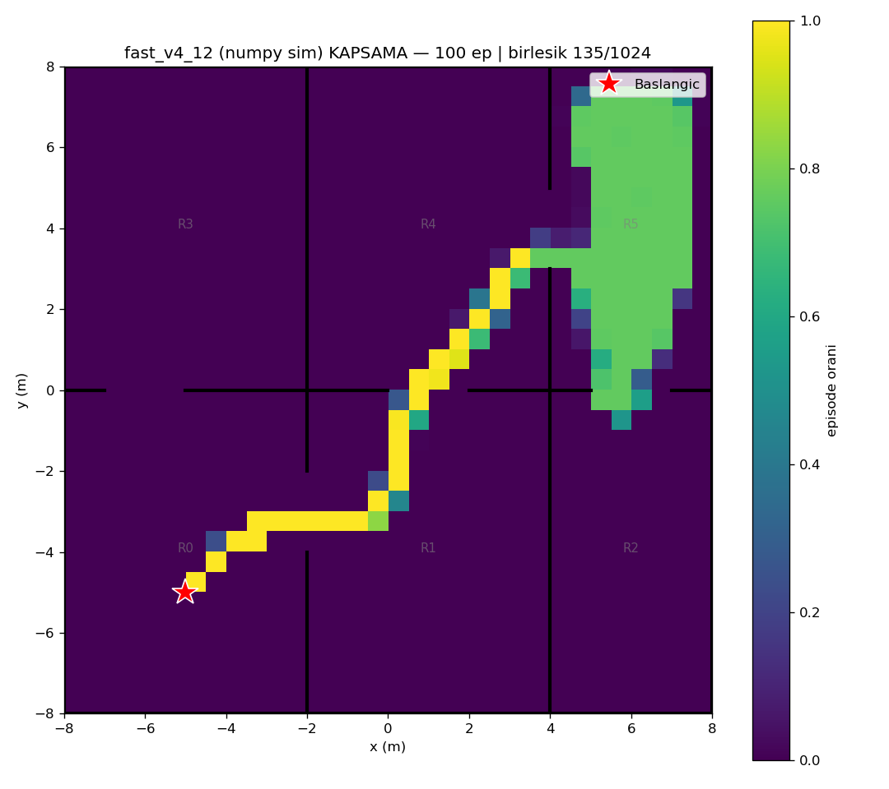
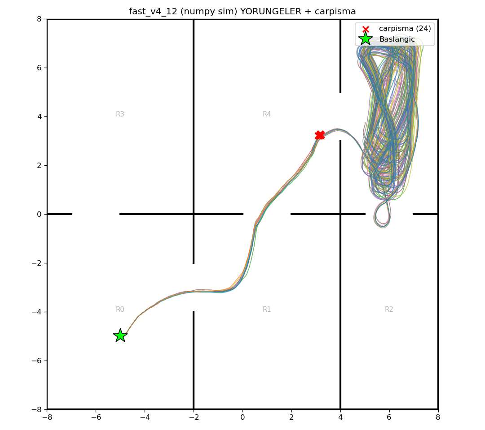

# fast_v4_12 (numpy/Gymnasium sim) — 100 episode

Model: `fast_drone_final.zip` | deterministic | hareketli engeller aktif | ~100x hizli sim

| Metrik | Deger |
|---|---|
| Return | 62.1 ± 15.3 (min 34, max 84) |
| Voxel / 1024 | 90.4 ± 34.7 (min 26, max 115) |
| Oda / 6 | 4.5 ± 0.9 (min 3, max 5) |
| Episode / 2500 | 1933.8 ± 1007.6 (min 140, max 2500) |
| Carpisma orani | 24% (24/100) |
| Birlesik kapsama | 135/1024 (13%) |

