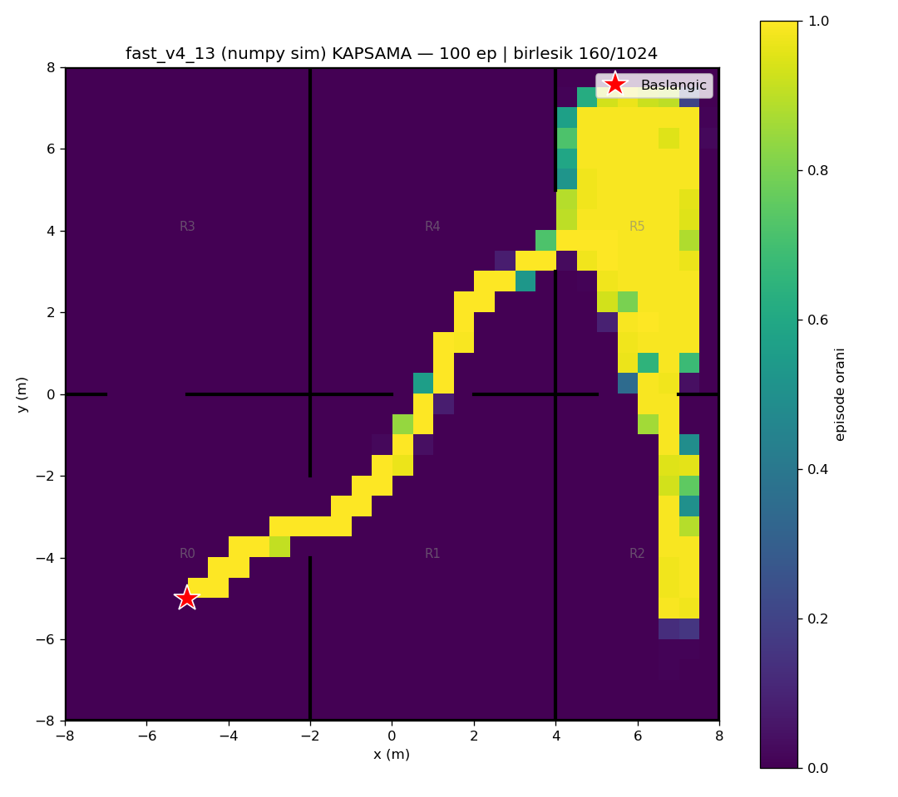
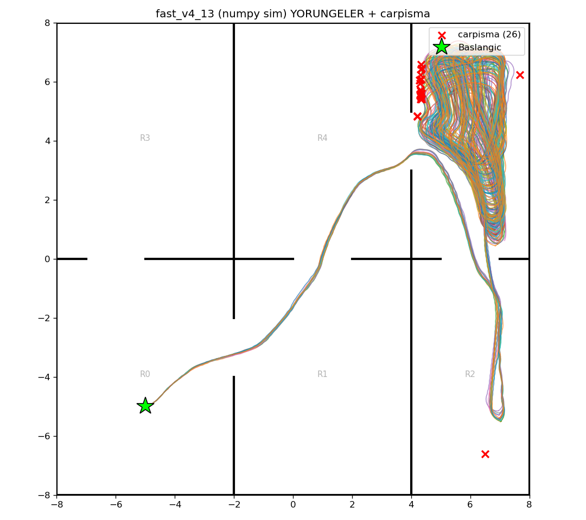

# fast_v4_13 (numpy/Gymnasium sim) — 100 episode

Model: `fast_drone_final.zip` | deterministic | hareketli engeller aktif | ~100x hizli sim

| Metrik | Deger |
|---|---|
| Return | 69.2 ± 11.7 (min 32, max 127) |
| Voxel / 1024 | 134.6 ± 8.1 (min 65, max 140) |
| Oda / 6 | 5.0 ± 0.1 (min 4, max 5) |
| Episode / 2500 | 2379.6 ± 322.2 (min 289, max 2500) |
| Carpisma orani | 26% (26/100) |
| Birlesik kapsama | 160/1024 (16%) |

