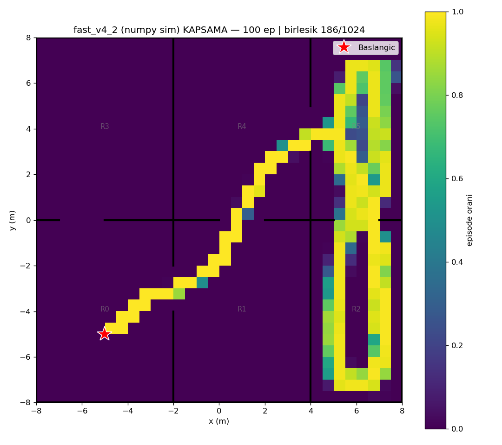
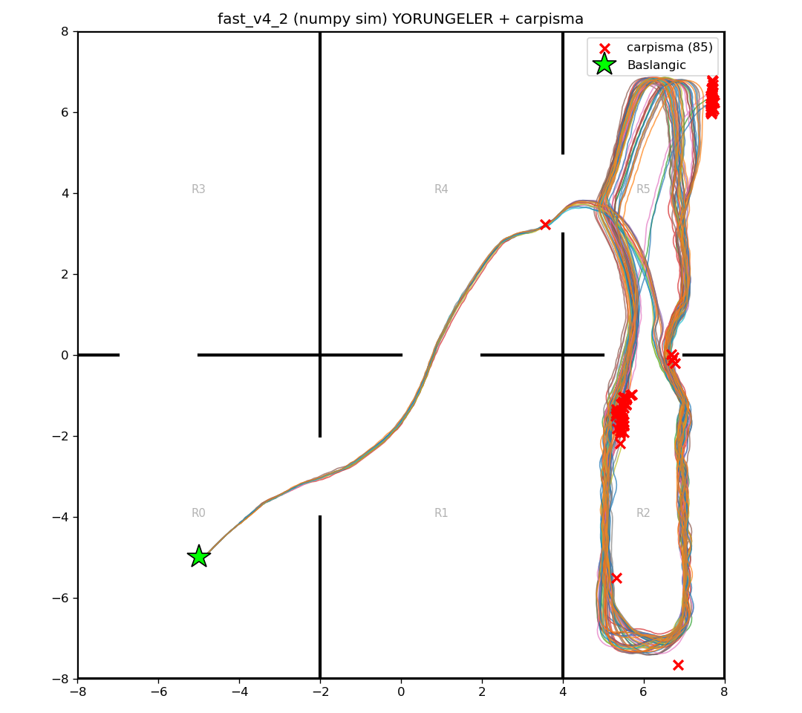

# fast_v4_2 (numpy/Gymnasium sim) — 100 episode

Model: `fast_drone_final.zip` | deterministic | hareketli engeller aktif | ~100x hizli sim

| Metrik | Deger |
|---|---|
| Return | 74.7 ± 33.2 (min 20, max 134) |
| Voxel / 1024 | 143.2 ± 19.0 (min 32, max 165) |
| Oda / 6 | 5.0 ± 0.2 (min 3, max 5) |
| Episode / 2500 | 1644.7 ± 640.2 (min 138, max 2500) |
| Carpisma orani | 85% (85/100) |
| Birlesik kapsama | 186/1024 (18%) |

