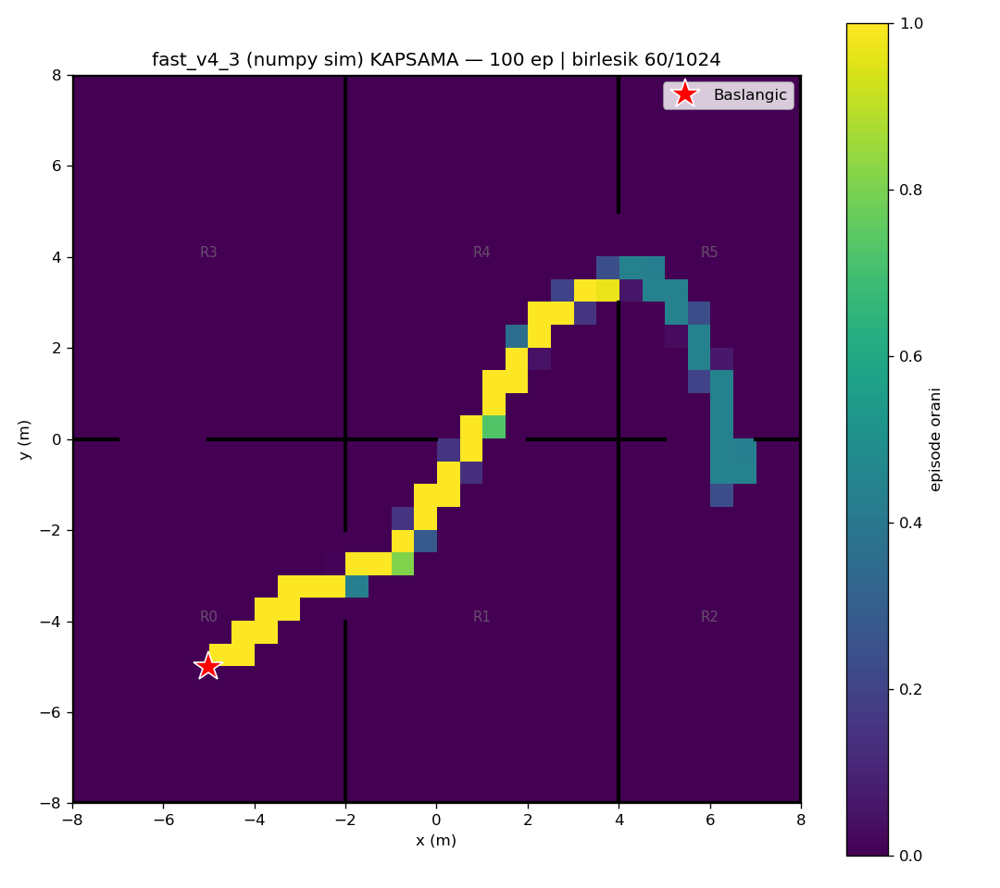
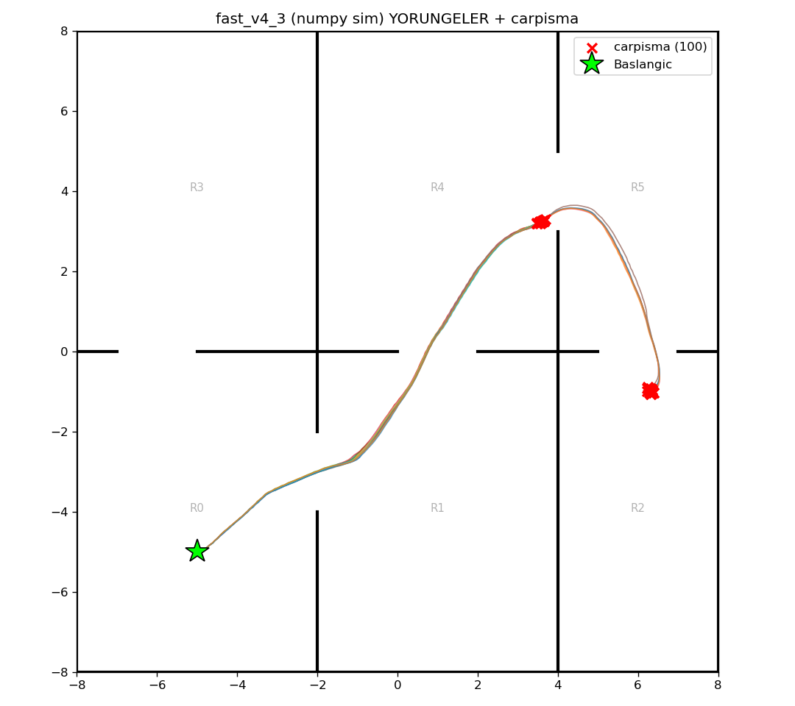

# fast_v4_3 (numpy/Gymnasium sim) — 100 episode

Model: `fast_drone_final.zip` | deterministic | hareketli engeller aktif | ~100x hizli sim

| Metrik | Deger |
|---|---|
| Return | 50.7 ± 16.1 (min 33, max 73) |
| Voxel / 1024 | 37.7 ± 8.6 (min 27, max 51) |
| Oda / 6 | 3.9 ± 1.0 (min 3, max 5) |
| Episode / 2500 | 168.3 ± 35.0 (min 136, max 209) |
| Carpisma orani | 100% (100/100) |
| Birlesik kapsama | 60/1024 (6%) |

