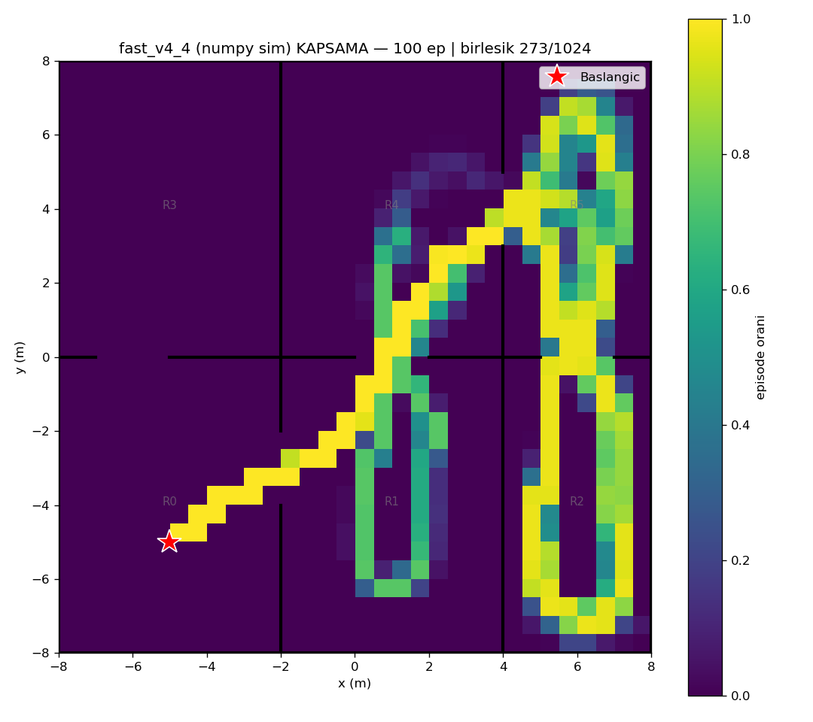
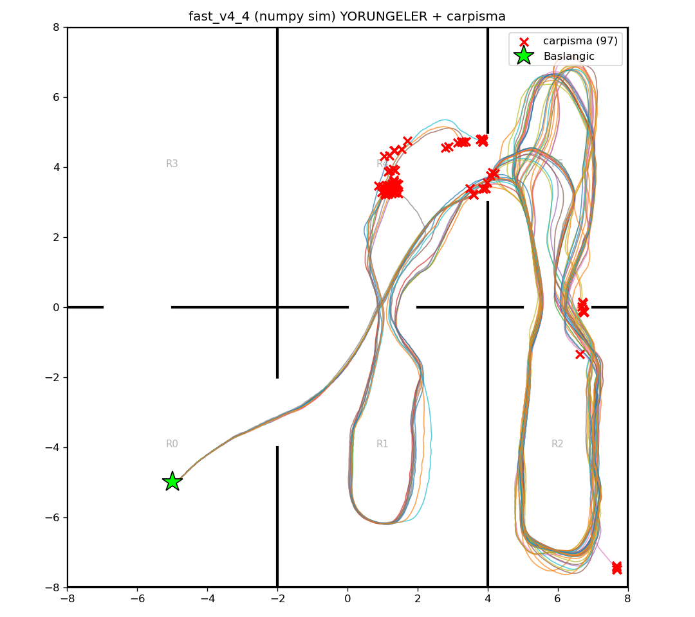

# fast_v4_4 (numpy/Gymnasium sim) — 100 episode

Model: `fast_drone_final.zip` | deterministic | hareketli engeller aktif | ~100x hizli sim

| Metrik | Deger |
|---|---|
| Return | 137.7 ± 33.1 (min 36, max 171) |
| Voxel / 1024 | 167.1 ± 28.0 (min 34, max 216) |
| Oda / 6 | 4.9 ± 0.3 (min 3, max 5) |
| Episode / 2500 | 1303.7 ± 454.8 (min 137, max 2500) |
| Carpisma orani | 97% (97/100) |
| Birlesik kapsama | 273/1024 (27%) |

