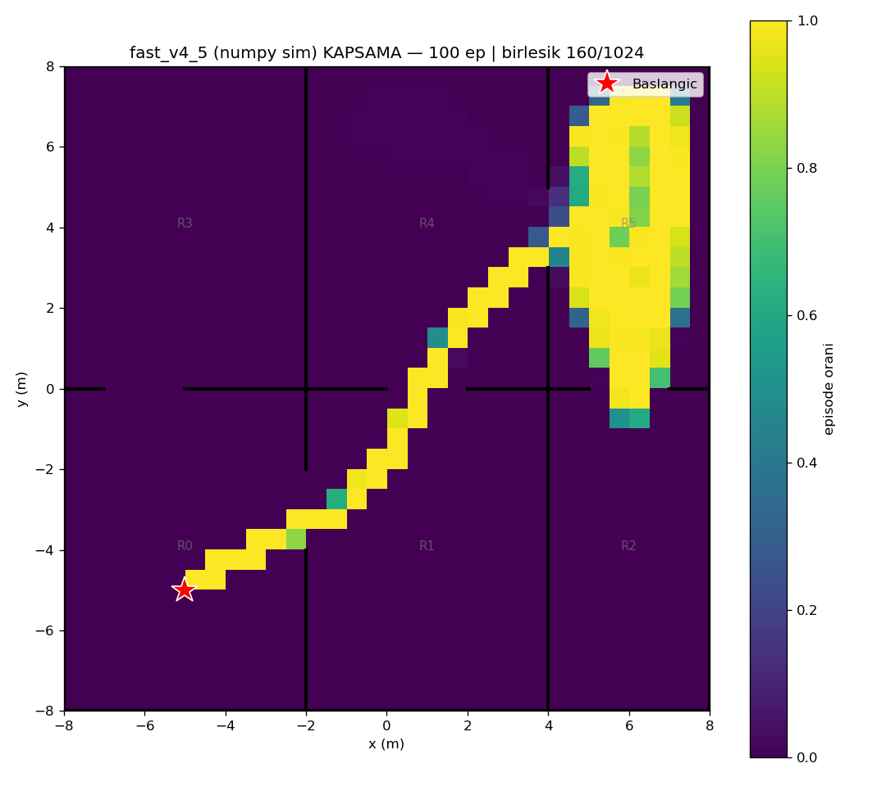
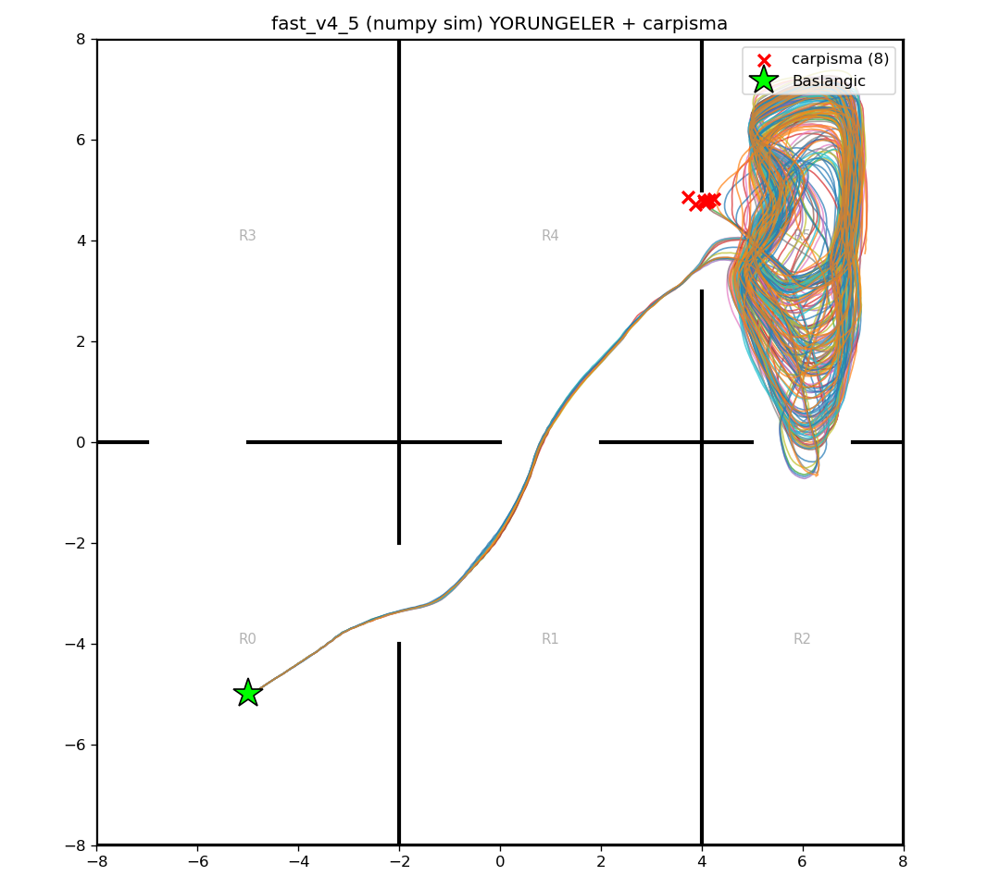

# fast_v4_5 (numpy/Gymnasium sim) — 100 episode

Model: `fast_drone_final.zip` | deterministic | hareketli engeller aktif | ~100x hizli sim

| Metrik | Deger |
|---|---|
| Return | 68.8 ± 16.3 (min 52, max 143) |
| Voxel / 1024 | 113.8 ± 4.0 (min 98, max 132) |
| Oda / 6 | 5.0 ± 0.0 (min 5, max 5) |
| Episode / 2500 | 2377.7 ± 419.0 (min 746, max 2500) |
| Carpisma orani | 8% (8/100) |
| Birlesik kapsama | 160/1024 (16%) |

