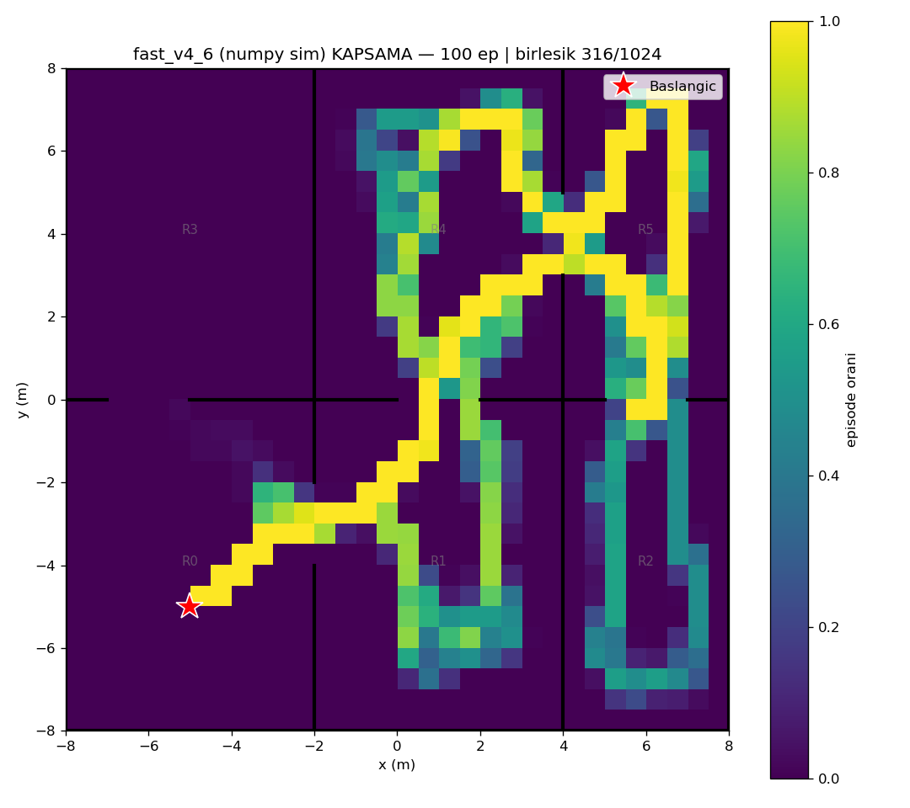
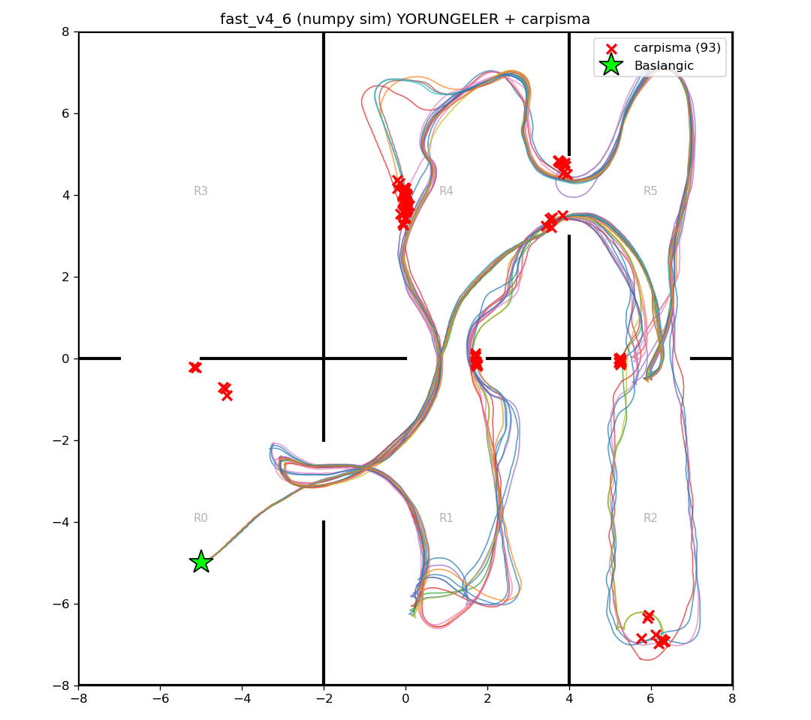

# fast_v4_6 (numpy/Gymnasium sim) — 100 episode

Model: `fast_drone_final.zip` | deterministic | hareketli engeller aktif | ~100x hizli sim

| Metrik | Deger |
|---|---|
| Return | 165.3 ± 25.5 (min 114, max 206) |
| Voxel / 1024 | 176.1 ± 43.1 (min 92, max 247) |
| Oda / 6 | 5.0 ± 0.0 (min 5, max 5) |
| Episode / 2500 | 1342.8 ± 607.5 (min 451, max 2500) |
| Carpisma orani | 93% (93/100) |
| Birlesik kapsama | 316/1024 (31%) |

