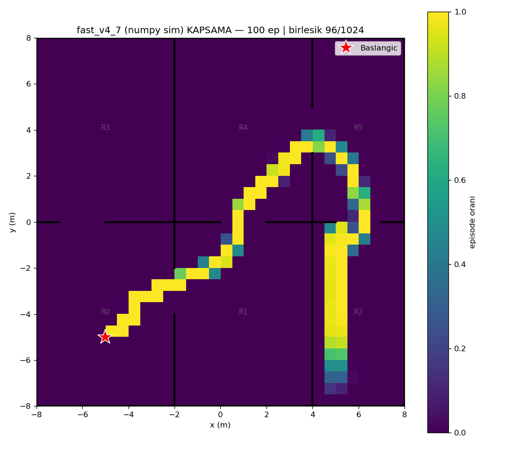
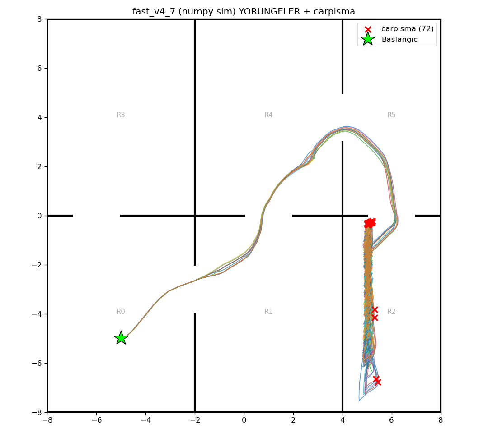

# fast_v4_7 (numpy/Gymnasium sim) — 100 episode

Model: `fast_drone_final.zip` | deterministic | hareketli engeller aktif | ~100x hizli sim

| Metrik | Deger |
|---|---|
| Return | -98.0 ± 44.9 (min -148, max 79) |
| Voxel / 1024 | 71.6 ± 4.2 (min 54, max 79) |
| Oda / 6 | 5.0 ± 0.0 (min 5, max 5) |
| Episode / 2500 | 2115.2 ± 465.1 (min 266, max 2500) |
| Carpisma orani | 72% (72/100) |
| Birlesik kapsama | 96/1024 (9%) |

