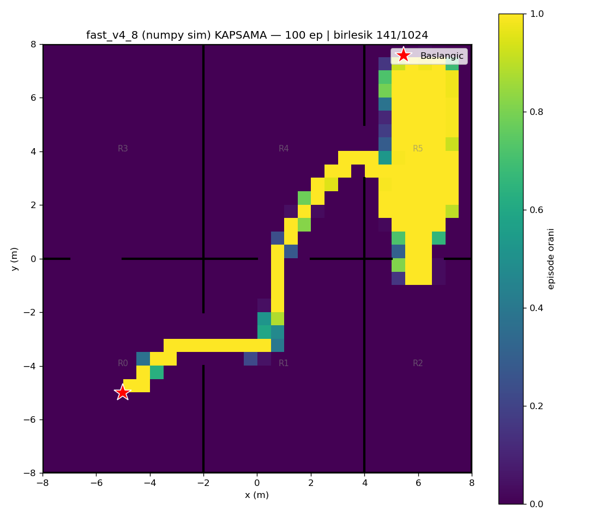
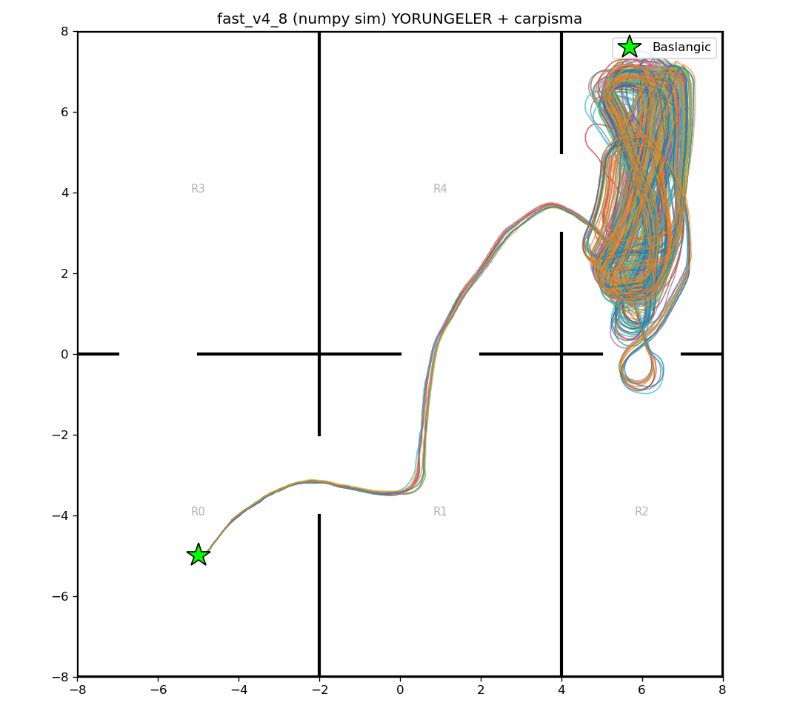

# fast_v4_8 (numpy/Gymnasium sim) — 100 episode

Model: `fast_drone_final.zip` | deterministic | hareketli engeller aktif | ~100x hizli sim

| Metrik | Deger |
|---|---|
| Return | 77.7 ± 7.6 (min 50, max 96) |
| Voxel / 1024 | 117.6 ± 2.5 (min 111, max 123) |
| Oda / 6 | 5.0 ± 0.0 (min 5, max 5) |
| Episode / 2500 | 2500.0 ± 0.0 (min 2500, max 2500) |
| Carpisma orani | 0% (0/100) |
| Birlesik kapsama | 141/1024 (14%) |

