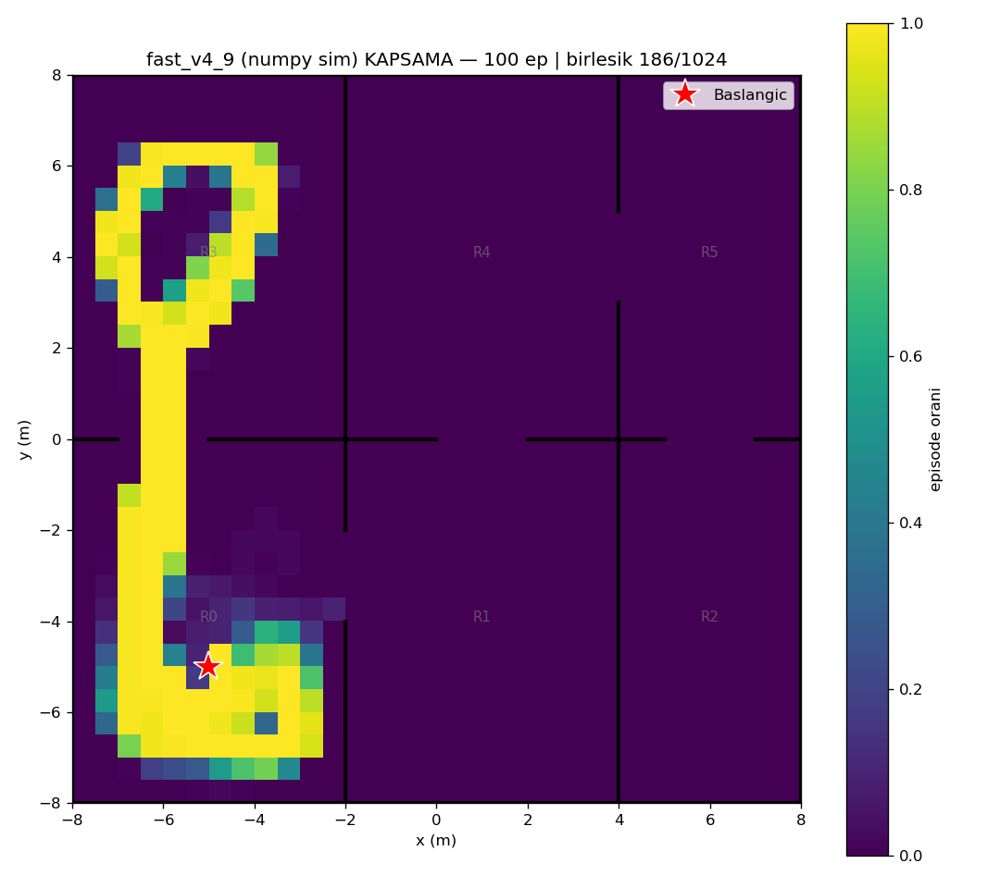
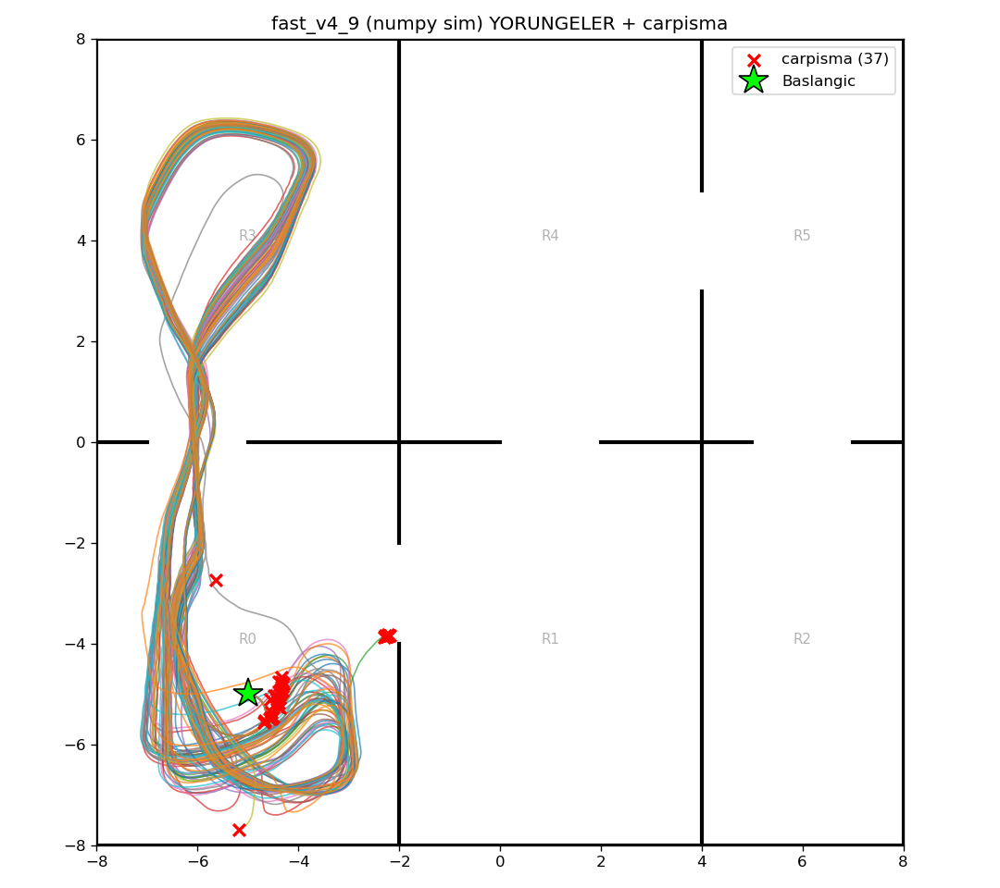

# fast_v4_9 (numpy/Gymnasium sim) — 100 episode

Model: `fast_drone_final.zip` | deterministic | hareketli engeller aktif | ~100x hizli sim

| Metrik | Deger |
|---|---|
| Return | 80.8 ± 10.7 (min 54, max 108) |
| Voxel / 1024 | 119.6 ± 8.9 (min 76, max 138) |
| Oda / 6 | 2.0 ± 0.0 (min 2, max 2) |
| Episode / 2500 | 2232.2 ± 511.1 (min 407, max 2500) |
| Carpisma orani | 37% (37/100) |
| Birlesik kapsama | 186/1024 (18%) |

