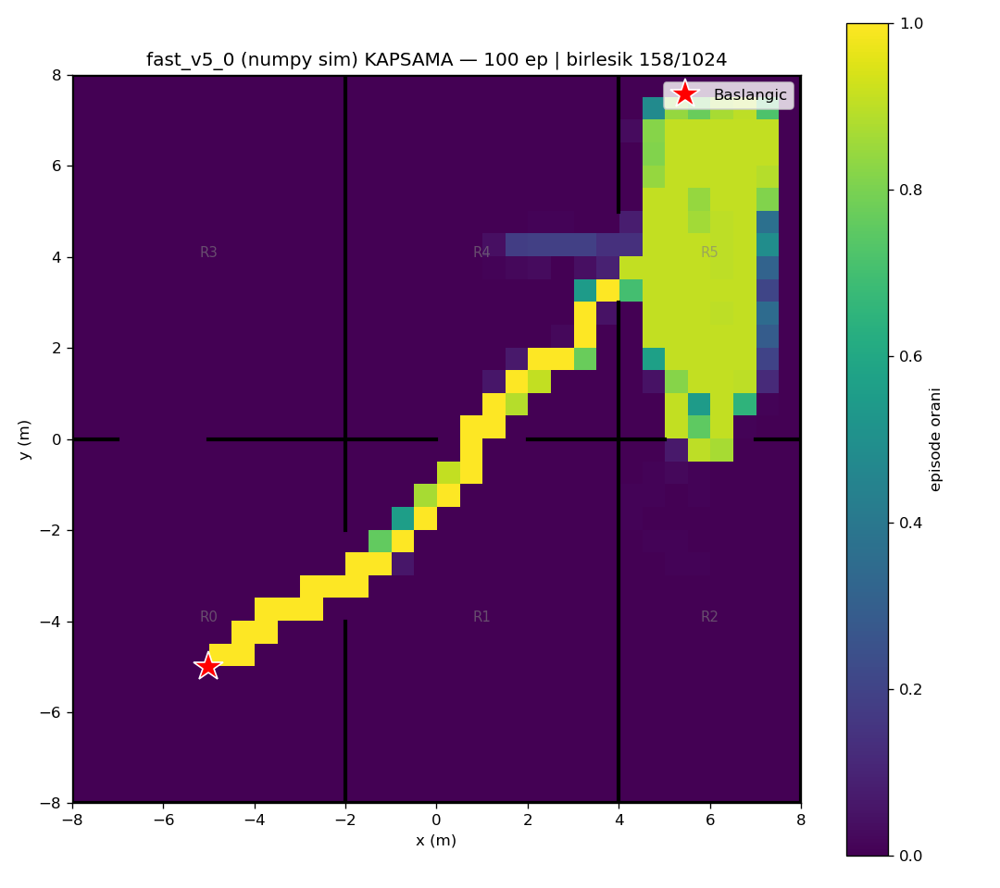
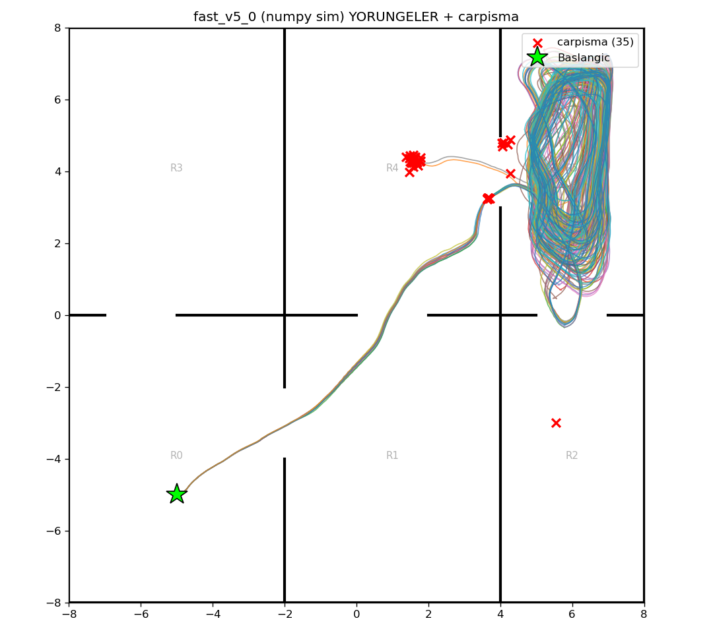

# fast_v5_0 (numpy/Gymnasium sim) — 100 episode

Model: `fast_drone_final.zip` | deterministic | hareketli engeller aktif | ~100x hizli sim

| Metrik | Deger |
|---|---|
| Return | 71.1 ± 12.2 (min 37, max 96) |
| Voxel / 1024 | 106.4 ± 23.6 (min 31, max 125) |
| Oda / 6 | 4.8 ± 0.6 (min 3, max 5) |
| Episode / 2500 | 2207.7 ± 669.7 (min 138, max 2500) |
| Carpisma orani | 35% (35/100) |
| Birlesik kapsama | 158/1024 (15%) |

