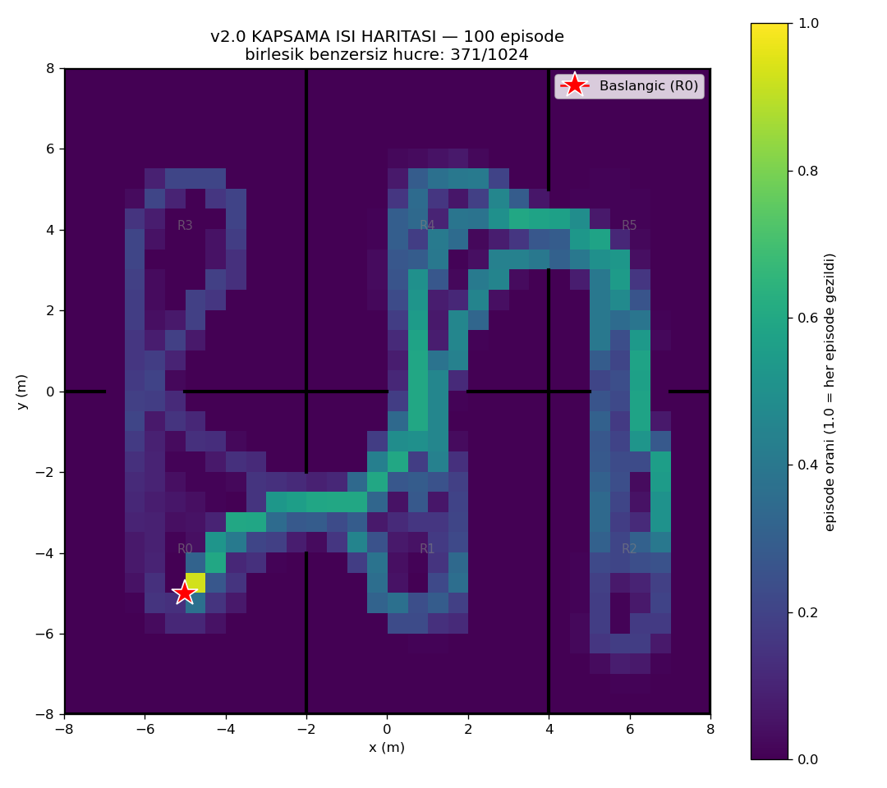
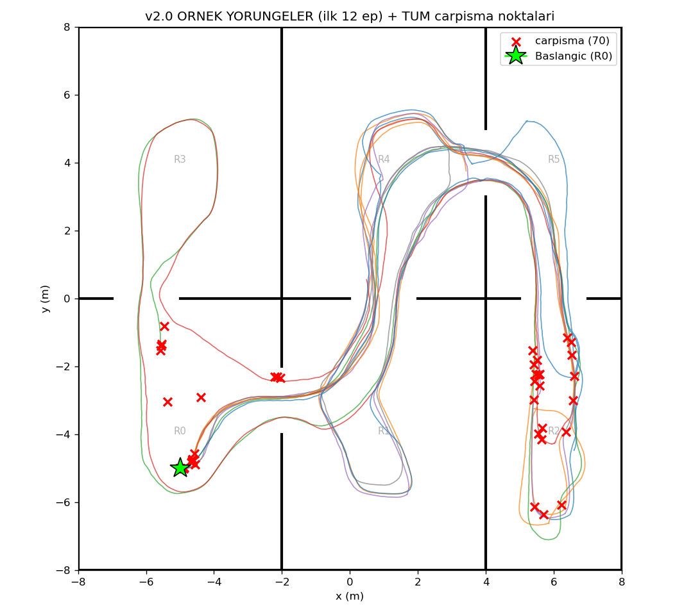

# v2.0 Performans Degerlendirmesi — 100 episode

Model: `ppo_drone_780000_steps.zip` | deterministic=True | hareketli engeller: aktif

## Istatistikler

| Metrik | Deger |
|---|---|
| Return (odul) | 85.8 ± 85.4  (min -11, max 230) |
| Kesfedilen voxel / 1024 | 80.1 ± 73.1  (min 1, max 201) |
| Ziyaret edilen oda / 6 | 3.6 ± 2.1  (min 1, max 6) |
| Episode uzunlugu / 1000 | 462.2 ± 433.9  (min 1, max 1000) |
| Carpisma orani | 70% (70/100) |
| Birlesik benzersiz hucre kapsama | 371/1024 (36%) |

## Yorum
- Episode'larin %70'i CARPISMA ile bitti (ort. 462/1000 adim). Carpismasa daha cok gezecek.
- 6 odanin ortalama 3.6'ine ulasiliyor (max 6).
- 100 episode birlesince haritanin %36'i en az bir kez geziliyor.

