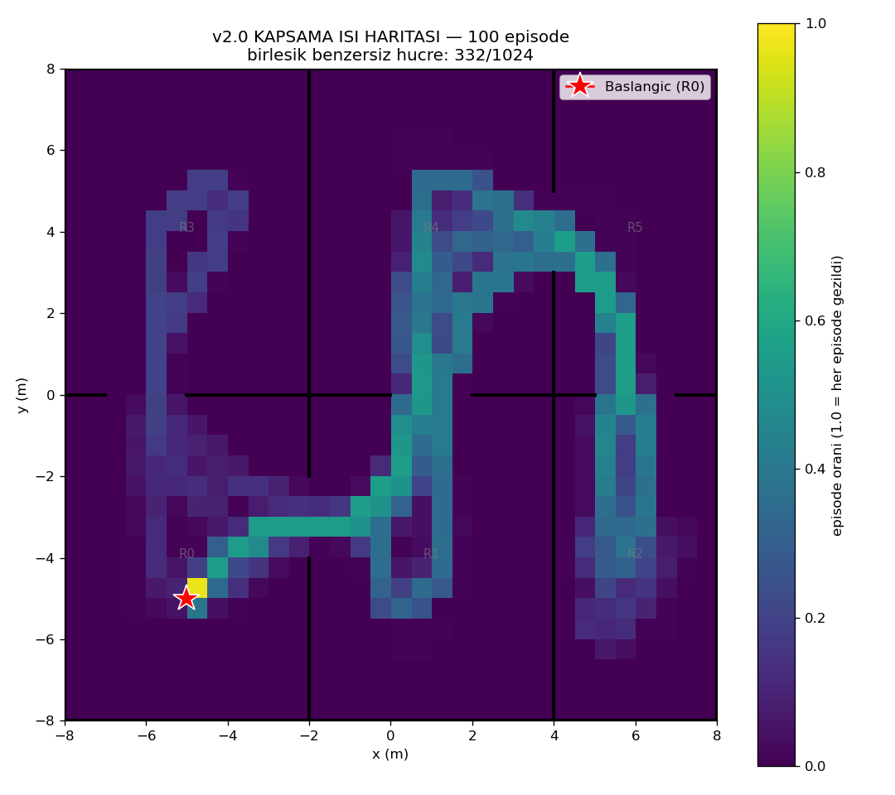
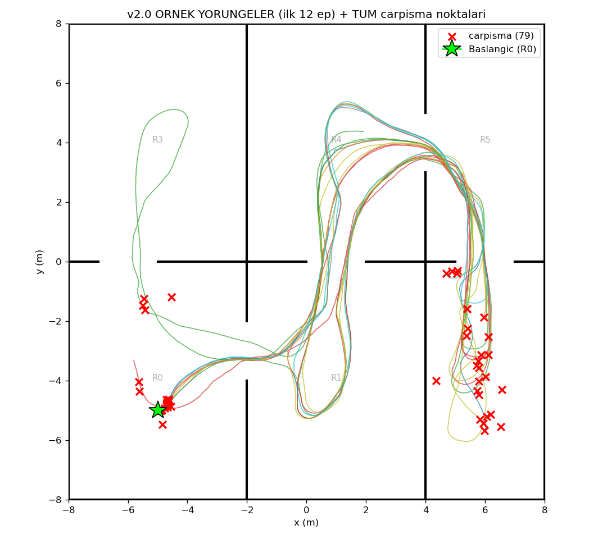

# v2.0 Performans Degerlendirmesi — 100 episode

Model: `ppo_drone_final.zip` | deterministic=True | hareketli engeller: aktif

## Istatistikler

| Metrik | Deger |
|---|---|
| Return (odul) | 99.9 ± 109.1  (min -10, max 292) |
| Kesfedilen voxel / 1024 | 69.1 ± 68.8  (min 1, max 195) |
| Ziyaret edilen oda / 6 | 3.4 ± 2.2  (min 1, max 6) |
| Episode uzunlugu / 1500 | 539.2 ± 605.6  (min 1, max 1500) |
| Carpisma orani | 79% (79/100) |
| Birlesik benzersiz hucre kapsama | 332/1024 (32%) |

## Yorum
- Episode'larin %79'i CARPISMA ile bitti (ort. 539/1500 adim). Carpismasa daha cok gezecek.
- 6 odanin ortalama 3.4'ine ulasiliyor (max 6).
- 100 episode birlesince haritanin %32'i en az bir kez geziliyor.

