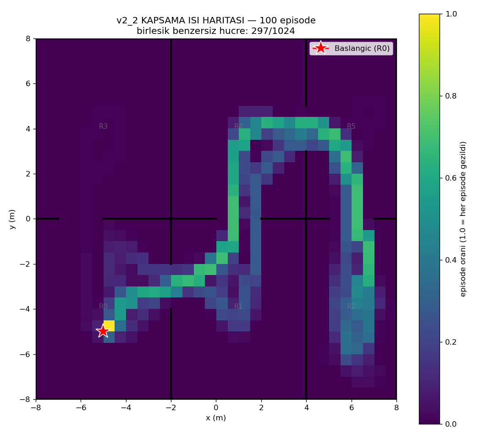
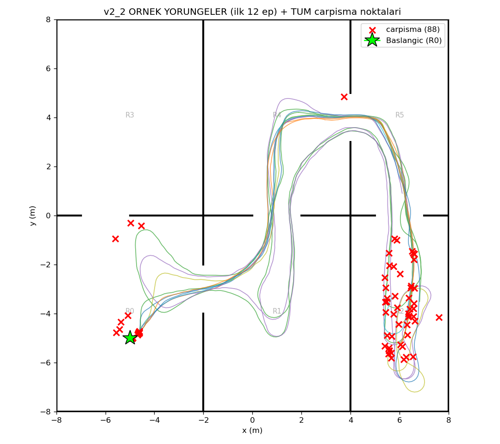

# v2.0 Performans Degerlendirmesi — 100 episode

Model: `ppo_drone_final.zip` | deterministic=True | hareketli engeller: aktif

## Istatistikler

| Metrik | Deger |
|---|---|
| Return (odul) | 79.7 ± 67.1  (min -13, max 201) |
| Kesfedilen voxel / 1024 | 65.9 ± 53.8  (min 1, max 168) |
| Ziyaret edilen oda / 6 | 3.8 ± 1.9  (min 1, max 6) |
| Episode uzunlugu / 1500 | 467.1 ± 487.3  (min 1, max 1500) |
| Carpisma orani | 88% (88/100) |
| Birlesik benzersiz hucre kapsama | 297/1024 (29%) |

## Yorum
- Episode'larin %88'i CARPISMA ile bitti (ort. 467/1500 adim). Carpismasa daha cok gezecek.
- 6 odanin ortalama 3.8'ine ulasiliyor (max 6).
- 100 episode birlesince haritanin %29'i en az bir kez geziliyor.

