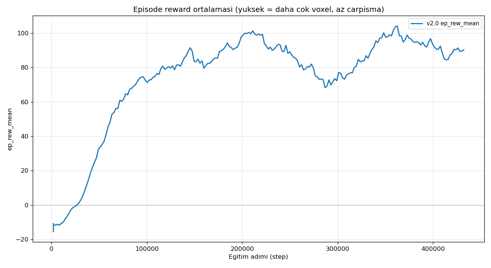
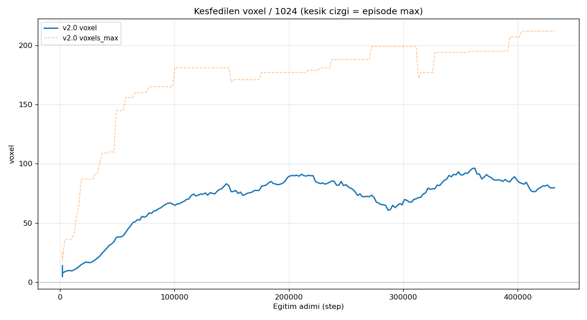
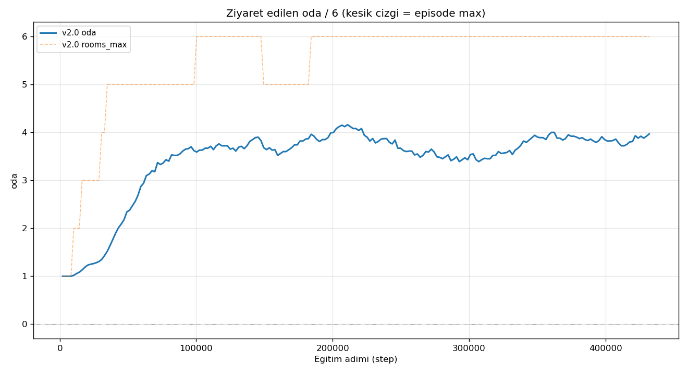

# PPO Drone Kesif — Egitim Raporu

Otomatik uretildi (`scripts/report.py`). Operator agent gunceller.

## Versiyon Ozeti

| Versiyon | Son step | Son reward | Peak reward | Peak voxel (max) | Peak oda (max) |
|---|---|---|---|---|---|
| v2.0 | 432,128 | +90.2 | +104.1 | 212/1024 | 6/6 |

## Versiyon / Mudahale Gunlugu

| Zaman | Versiyon | Tip | Aciklama |
|---|---|---|---|
| 2026-05-31 04:30 | v2.0 | redesign | Sifirdan temiz baslangic: 2D action [v,w], sabit R0 spawn, 40-d obs, temiz odul (return~=voxel). Tek env (n_envs=1), coklu gazebo kaldirildi. VecNormalize(norm_reward). Hedef 2M step. |

## Figurler

